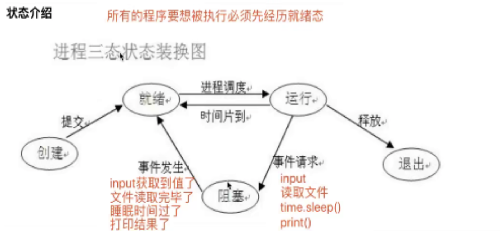

### 多道技术

- 并发 看起来像同时运行的就可以称之为并发
- 并行 真正意义上的同时执行

ps:

- 并行肯定是并发
- 单核的计算机肯定不能实现并行,但可以实现并发

多道技术节省了多个程序运行时的总耗  
分为空间上的复用与时间上的复用

- 空间上的复用  
  多个程序共用一套计算机硬件
- 时间上的复用  
  例如: 洗衣服 20s, 煮饭 30s, 烧水 10s 可以同时进行

**切换+保存状态**

```angular2html
切换(CPU)分为两种情况
1.当一个程序遇到IO操作的时候,操作系统会剥夺该程序的CPU执行权限
作用: 提高了CPU的利用率,并且也不影响程序的执行效率
2.当一个程序长时间占用CPU的时候,操作系统也会剥夺该程序的CPU执行权限
作用: 降低了程序的执行效率(原本程序执行时间+切换开销时间)
```

### 进程理论

进程与程序的区别

```angular2html
程序就是一堆躺在硬盘上的代码,是"死"的
进程则表示程序正在执行的过程,是"活"的
```

#### 进程调度

- 先来先服务调度算法

```angular2html
对长作业有利,对短作业无益
```

- 短作业优先调度算法

```angular2html
对短作业有利,对长作业无益
```

- 时间片轮转法,多级反馈队列
  

#### 进程运行的三状态图




### 两对重要概念

- **同步和异步**

```angular2html
"""   描述的是任务的提交方式   """
同步: 任务提交之后,原地等待任务的返回结果,等待的过程中不做任何事情
程序层面上表现出来的感觉就是卡住了

异步: 任务提交之后,不原地等待任务的返回结果,直接去做其他事情
提交的任务结果如何获取
任务的返回结果h会有一个异步回调机制自动处理
```

- **阻塞和非阻塞**

```angular2html
"""   描述的是程序的运行状态   """
阻塞:  阻塞态
非阻塞: 就绪态,运行态
```

上述的概念的组合,最高效的一种组合是**异步非阻塞**  
理想状态: 应该让写的代码永远处于就绪态和运行态之间切换

#### 创建进程的两种方法

```angular2html
创建进程就是在内存中申请一块内存空间将需要运行的代码丢进去
一个进程对应在内存中就是一块独立的内存空间
多个进程对应在内存中就是多块独立的内存空间
进程与进程之间数据默认情况下是无法直接交互,如果想交互可以借助于第三方工具,模块
```

#### join方法

join是让主进程等待子进程代码运行结束之后,再继续运行.不影响其他子进程的执行

### 互斥锁

多个进程在操作同一份数据的时候,会出现数据错乱的问题 针对上述问题,解决方式就是加锁处理: **将并发变成串行,牺牲效率但是保证了数据的安全**

### 进程间通信

```angular2html
队列: 先进先出
堆栈: 先进后出
```

### 生产者消费者模型

```angular2html
生产者: 生产/制造数据
消费者: 消费/处理数据
该模型除了需要上述两个还需要一个媒介
做包子的将包子做好后放在蒸笼(媒介)里,卖包子的去蒸笼里面拿
生产者消费者之间不直接做交互,而是借助于媒介做交互
生产者(做包子的) + 消息队列(蒸笼) + 消费者(卖包子的)
```

### 线程

```angular2html
进程: 资源单位(起一个进程仅仅只是在内存空间中开辟了一块独立的空间)
线程: 执行单位(真正被CPU执行的其实是进程里面的线程,线程指的就是代码的执行过程,执行代码中所需要使用到的资源都找所在的进程索要)

如果将操作系统比作一个大工厂,那么进程就相当于工厂里的车间,而线程就是车间里的流水线

每一个进程肯定自带一个线程

进程和线程都是虚拟单位,只是为了更加方便的描述问题
```

```angular2html
开设进程:
1. 申请内存空间 消耗资源
2. '拷贝代码' 消耗资源

开线程:
一个进程内可以开设多个线程,在用一个进程内开设多个线程无序再次申请内存空间操作

总结:
开设线程的开销要远远小于开设进程的开销
同一个进程下的多个线程数据是共享的
```

### GIL与普通互斥锁的区别

```angular2html
"""
In CPython, the global interpreter lock, or GIL, is a mutex that prevents multiple
native threads from executing Python bytecodes at once. This lock is necessary mainly
because CPython’s memory management is not thread-safe. (However, since the GIL
exists, other features have grown to depend on the guarantees that it enforces.)
"""
"""
python解释器其实有多个版本
Cpython
Jpython
Pypypython
但是普遍使用的都是CPython解释器

在CPython解释器中GIL是一把互斥锁，用来阻止同一个进程下的多个线程的同时执行
同一个进程下的多个线程无法利用多核优势！！！
疑问:python的多线程是不是一点用都没有？？？无法利用多核优势

因为cpython中的内存管理不是线程安全的
内存管理(垃圾回收机制)
1.应用计数
    没被调用一次引用计数+1 反之-1
2.标记清楚
    当时引用计数为0时,当内存达到某一值垃圾回收
3.分代回收
    因为每个变量的时间长度不一样,而垃圾回收也需要资源,于是出现了分带回收,
    新生代、老年代和永久代 越往后检查频率越低

"""

"""
重点:
1.GIL不是python的特点而是CPython解释器的特点
2.GIL是保证解释器级别的数据的安全
3.GIL会导致同一个进程下的多个线程的无法同时执行即无法利用多核优势(******)
4.针对不同的数据还是需要加不同的锁处理
5.解释型语言的通病:同一个进程下多个线程无法利用多核优势
"""
```


### 同一个进程下的多线程无法利用多核优势,是不是就没有用了

```angular2html
"""
多线程是否有用要看具体情况
单核:四个任务(IO密集型\计算密集型)
多核:四个任务(IO密集型\计算密集型)
"""
# 计算密集型   每个任务都需要10s
单核(不用考虑了)
多进程:额外的消耗资源
多线程:介绍开销
多核
多进程:总耗时 10+
多线程:总耗时 40+
# IO密集型
多核
多进程:相对浪费资源
多线程:更加节省资源
```

总结

```angular2html
多进程和多线程都有各自的优势
并且我们后面在写项目的时候通常可以
    多进程下面再开设多线程
这样的话既可以利用多核也可以减少资源消耗
```

### 进程池与线程池(重要)
```angular2html
什么是池:
    池是用来保证计算机硬件安全的情况下最大限度的利用计算机
    它降低了计算机的运行效率,但是保证了计算机硬件的安全,从而让你写的程序能够正常运行
```