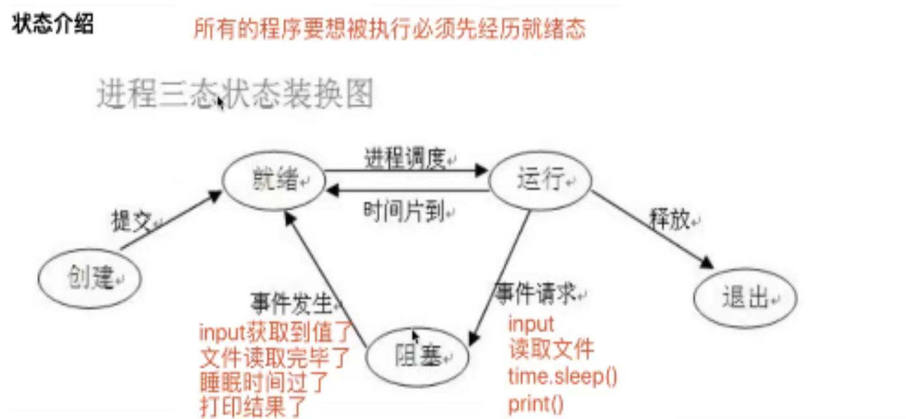

###多道技术
  - 并发
    看起来像同时运行的就可以称之为并发
  - 并行
    真正意义上的同时执行
  
ps:
  - 并行肯定是并发
  - 单核的计算机肯定不能实现并行,但可以实现并发

多道技术节省了多个程序运行时的总耗  
分为空间上的复用与时间上的复用
  - 空间上的复用  
      多个程序共用一套计算机硬件
  - 时间上的复用  
      例如: 洗衣服 20s,  煮饭 30s,  烧水 10s
            可以同时进行
    
**切换+保存状态**
```angular2html
切换(CPU)分为两种情况
    1.当一个程序遇到IO操作的时候,操作系统会剥夺该程序的CPU执行权限
        作用: 提高了CPU的利用率,并且也不影响程序的执行效率
    2.当一个程序长时间占用CPU的时候,操作系统也会剥夺该程序的CPU执行权限
        作用: 降低了程序的执行效率(原本程序执行时间+切换开销时间)
```

###进程理论
进程与程序的区别
```angular2html
程序就是一堆躺在硬盘上的代码,是"死"的
进程则表示程序正在执行的过程,是"活"的
```

####进程调度
  - 先来先服务调度算法
```angular2html
对长作业有利,对短作业无益
```
  - 短作业优先调度算法
```angular2html
对短作业有利,对长作业无益
```
  - 时间片轮转法,多级反馈队列
```angular2html
```
  -


